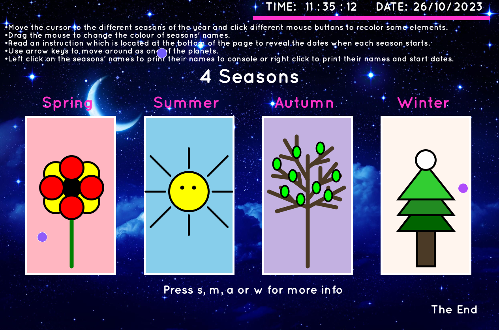
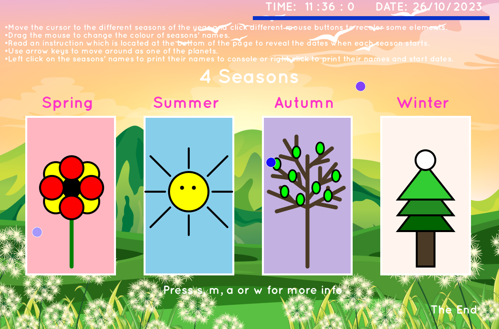
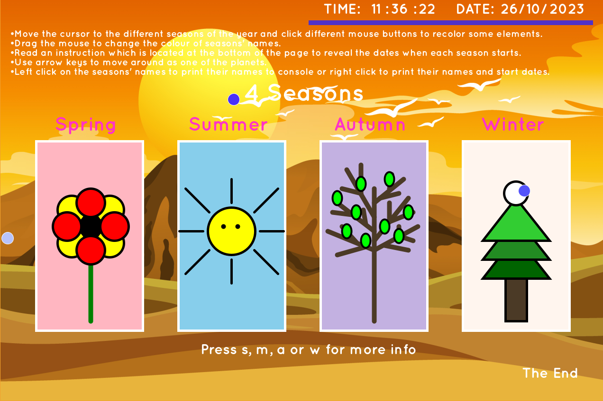
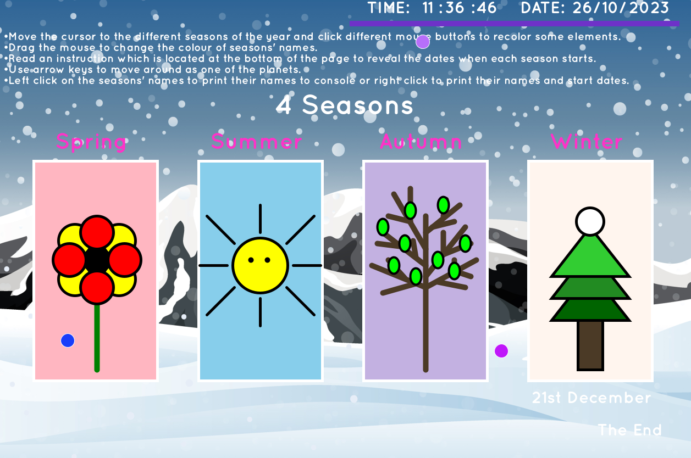

# ☀️🍂 Fours Seasons ❄️🌱

## Project Overview 🌟

This project was created as a personal endeavor to explore the world of dynamic graphics and interactive animations. The goal was to craft an engaging visual experience that celebrates the beauty of the changing seasons.

## Features 🚀

My Java Programming Fundamentals project includes the following notable features:

1. **Animation Setup**: I've implemented an animated display window by utilizing the `setup()` function. This includes setting the initial size of the display window, loading essential images for the animation, and configuring the initial position of moving objects such as planets.

2. **Interactive Elements**: The program is enriched with interactive elements that respond to user inputs. This includes using the `draw()` function to create engaging user experiences. Elements like background changes based on cursor position, dynamic colors for shapes, and the appearance of text depending on which key is pressed are key highlights.

3. **2D Primitives**: The project showcases the creative use of 2D Primitives for drawing various graphics. Whether it's creating trees, sunlights, flowers, or seasonal backgrounds, I've harnessed the power of 2D Primitives to bring visual elements to life.

4. **Color Manipulation**: Throughout the project, I've used functions like `fill()`, `stroke()`, and `noStroke()` to control and change the colors of objects. This provides a dynamic and visually engaging experience for the users.

5. **Text and Fonts**: Text is a crucial part of the project, and I've effectively utilized the `text()` function. Additionally, I've loaded custom fonts using the `createFont()` and `textFont()` functions to give the text a unique style.

6. **Real-time Information**: Users can access real-time date and time information in the top right corner of the display window. I've employed functions like `day()`, `month()`, `year()`, `hour()`, `minute()`, and `second()` to make this possible.

7. **Randomization**: I've used the `random()` function to generate random numbers, which is particularly evident in the ever-changing colors of the shooting stars, providing an element of surprise and delight in the graphics.

8. **Program Control**: The project allows users to exit gracefully using the `exit()` function. This is triggered when the "The End" text is clicked with the mouse button.

9. **Mouse Interactions**: I've implemented several mouse-related functions such as `mousePressed()`, `mouseMoved()`, and `mouseReleased()` to create interactive features like changing colors when the cursor moves or triggering specific actions when mouse buttons are pressed.

10. **Key Inputs**: The program is responsive to key inputs. It moves the planet based on the keys pressed and displays season starting dates when specific keys are triggered.

11. **Cursor Symbol Changes**: I've leveraged the `cursor()` function to dynamically change the cursor symbol to provide users with visual feedback as they interact with the program.

The project is a culmination of various features and concepts learned during my course, demonstrating my ability to apply programming fundamentals to create a visually engaging and interactive application.

## Visual Delights 🌟

This project offers a vibrant canvas for you to explore:
- Dynamic background changes based on cursor position.
- Interactive color shifts triggered by mouse interactions.
- Mesmerizing animations, including shooting stars and a planet in motion.
- Real-time date and time display on the canvas.

## Examples 🌄

## Author 👩‍💻

This project was authored by Malgorzata Victor.

## References 📚

- [Processing Documentation](https://processing.org/reference/)
- [Stack Overflow](https://stackoverflow.com/questions)
- [Processing Forum](https://forum.processing.org/)
- [Processing Community](https://discourse.processing.org/)
- Class Notes

